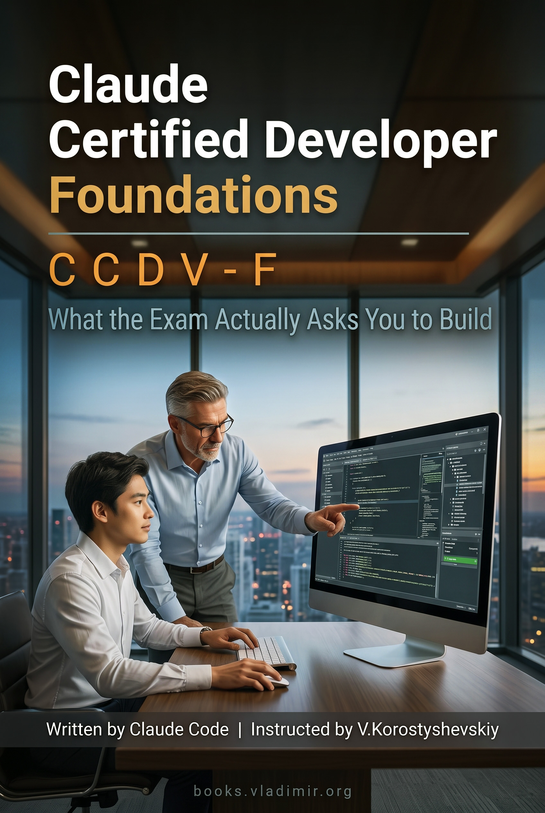

# Claude Certified Developer – Foundations (CCDV-F)

### What the Exam Actually Asks You to Build

A practitioner guide for the Anthropic **CCDV-F** certification: 23 chapters, around 75K words, covering all 25 skills across the eight exam domains. Request mechanics and failure seams, model and thinking settings, prompt placement, structured output, context and cost, tools and MCP servers, agents and Claude Code, application design, configuration, tracing, prompt injection, guardrails, secrets, and what happens after deploy.

The editorial position is this: nearly every wrong answer on this exam is a mechanism that works perfectly well somewhere else. A Skill where a server was needed, a context file where a hook was needed, a retry where the failure was permanent. So knowing that a mechanism exists is worth very little, and knowing what it is for is worth almost everything. The book argues each choice to the point where the boundary between two mechanisms is visible, on the theory that reasoning transfers to a scenario nobody has seen and a memorised feature list does not.

The other thing worth knowing before you start: **a third of this exam is not about Claude.** Domain 2 alone is 33.1% and covers REST semantics, versioning, review discipline and application boundaries. Domain 4, on evaluation, testing and debugging, is 2.6%. That is a thirteen-fold spread, and a reader who budgets study time by how interesting a topic looks will spend their evenings in the wrong place.

> **Tested.** I sat CCDV-F on 14 September 2026 and [passed](https://www.credly.com/earner/earned/badge/a7e99fb7-93cb-44c9-bc7e-176ce5e860cf). There were no other books, tutorials or courses.

## How the chapters are built

Every chapter carries the same apparatus in the same order, so you can open one you have not read and know where you are.

It opens with an italic summary naming the decision at stake and what it costs to get wrong. The headers underneath state their conclusions, which makes the header list inside a chapter a usable summary of it. Anything with parallel structure goes into a table instead of a paragraph. Mistakes get names, in bold. A mistake with a name is one you can recognise among options you are seeing for the first time.

Each chapter then takes apart the way wrong answers are constructed from its own material, and closes that section on a three-column table pairing a signal in the question with the answer it normally points to and the trap it normally conceals. The rows are cues, not worked cases, which is what lets them apply to a scenario set in some industry the book never once mentions.

Then a closing list of things to remember, written so each line survives with the chapter shut.

If you are short of time, that closing list is the part to know about. Read all twenty-three of them first, then go back into the chapters behind any line you could not immediately justify.

## Contents

Every chapter below links to its Markdown source. The PDF and EPUB carry the same text.

[**Preface**](./book/chapters/00-preface.md)

**Part I. What this exam is asking**

1. [What This Exam Tests That an Interview Does Not](./book/chapters/01-what-the-exam-is-actually-testing.md)

**Part II. The call, and the model behind it**

2. [Four Parts to Every Call, and Three Places It Breaks](./book/chapters/02-how-a-request-reaches-claude.md)
3. [Messages, Streaming, Batches: Who Is Waiting Decides](./book/chapters/03-the-api-surface-you-will-be-asked-about.md)
4. [A Model Choice Is Three Numbers You Were Not Given](./book/chapters/04-choosing-a-model.md)

**Part III. Getting an answer you can use**

5. [Instruction Placement Is a Trust Decision](./book/chapters/05-prompts-that-hold-their-shape.md)
6. [Schema-Valid Is Not the Same as Correct](./book/chapters/06-output-a-program-can-consume.md)
7. [The Window Is a Budget, and Everything Competes](./book/chapters/07-context-as-a-budget.md)
8. [Cost Follows What You Resend, Not What You Ask](./book/chapters/08-cost-and-tokens.md)

**Part IV. Giving Claude something to do**

9. [The Description Is the Input, Not the Documentation](./book/chapters/09-tools-claude-selects-correctly.md)
10. [One Server, Many Clients, Transport by Locality](./book/chapters/10-mcp-servers.md)
11. [Four Mechanisms, Decided by What Must Execute](./book/chapters/11-built-in-custom-skill-or-mcp.md)

**Part V. Agents, and what you stop owning**

12. [Known Steps Take a Chain; Unknown Ones an Agent](./book/chapters/12-workflow-or-agent.md)
13. [The Loop, the Harness, and What You Stop Owning](./book/chapters/13-building-the-agent.md)
14. [Permission Modes and Where the Human Gate Goes](./book/chapters/14-claude-code-as-a-configured-tool.md)

**Part VI. The application around the model**

15. [The Constraints Nobody States Decide the Design](./book/chapters/15-requirements-before-architecture.md)
16. [Boundaries, Sessions, and Where Instructions Land](./book/chapters/16-designing-the-application.md)
17. [REST, Versioning, Review: the Exam Beyond Claude](./book/chapters/17-the-engineering-around-the-model.md)
18. [An Unpinned Version Is an Untracked Change](./book/chapters/18-configuration-as-a-tracked-artifact.md)

**Part VII. Things that go wrong**

19. [A Test Says It Broke; a Trace Says Where](./book/chapters/19-evals-testing-and-tracing.md)
20. [The Attack Arrives as Content You Asked For](./book/chapters/20-untrusted-input.md)
21. [A Rule in a Prompt Is Not Enforcement](./book/chapters/21-guardrails-that-hold.md)
22. [One Credential: What It Reaches, and for How Long](./book/chapters/22-secrets-and-identity.md)

**Part VIII. After go-live**

23. [Deploy Is a Phase Boundary, Not the End](./book/chapters/23-shipping-and-what-comes-after.md)

**Back matter**: [Coverage Map](./book/chapters/95-coverage-map.md) · [Glossary](./book/chapters/96-glossary.md)

## Why the chapters are not in exam order

The published blueprint lists eight domains in a fixed order, and this book does not follow it.

Blueprint order is a filing system. It groups skills by the department that owns them, which is the correct way to write an exam and the wrong way to learn anything, because it separates decisions that get made in the same hour and joins decisions that are months apart. Choosing a request shape and knowing who is waiting for it are one act, and the blueprint files them under different skills. So the chapters run in the order the work happens: what a call is, then what the model does with it, then what you feed it, then what you let it call, then whether it needs a loop at all, then the application around it, then everything that goes wrong, then go-live.

An ordering bet like that is only defensible if it costs no coverage, so the book carries a proof of it. The [Coverage Map](./book/chapters/95-coverage-map.md) is generated from the blueprint and from the book's own structure, and it **fails to build if any skill is unclaimed or claimed twice**, and again if it names a chapter that is not on disk.

## The eight domains

Weights are the published ones, and this blueprint gives a weight per **skill** rather than only per domain, which is finer detail than most certifications hand out. Read the chapter numbers as where this book spends its pages.

- **Applications and Integration** (33.1%, Chs [3](./book/chapters/03-the-api-surface-you-will-be-asked-about.md), [15](./book/chapters/15-requirements-before-architecture.md), [16](./book/chapters/16-designing-the-application.md), [17](./book/chapters/17-the-engineering-around-the-model.md), [18](./book/chapters/18-configuration-as-a-tracked-artifact.md), [23](./book/chapters/23-shipping-and-what-comes-after.md)): the largest domain by a wide margin and the one candidates under-read, because half of it is ordinary software engineering pointed at an unusual dependency. Who is waiting decides the request shape. A boundary exists whether or not anybody drew it. The constraint that predates the request and appears in nobody's description of the work. Versioning, review, idempotent retries, and the fact that a prompt edited in production is a deployment.
- **Model Selection and Optimization** (16.8%, Chs [1](./book/chapters/01-what-the-exam-is-actually-testing.md), [2](./book/chapters/02-how-a-request-reaches-claude.md), [4](./book/chapters/04-choosing-a-model.md), [8](./book/chapters/08-cost-and-tokens.md)): why one request run twice returns two answers and nothing is broken, the four parts every call carries and the three seams between them, model and thinking and effort as three settings rather than one quality dial, and cost as a function of what you resend rather than what you ask.
- **Agents and Workflows** (14.7%, Chs [12](./book/chapters/12-workflow-or-agent.md), [13](./book/chapters/13-building-the-agent.md)): the test that settles workflow against agent before any comparison starts, five workflow shapes each selected by a different thing the task leaves open, what a coordinator owns at every handoff, and the two columns of what adopting a framework deletes and what it installs.
- **Prompt and Context Engineering** (11.0%, Chs [5](./book/chapters/05-prompts-that-hold-their-shape.md), [6](./book/chapters/06-output-a-program-can-consume.md), [7](./book/chapters/07-context-as-a-budget.md)): sorting a prompt by how long its text applies and who could have written it, the difference between a response that is addressable and one that is true, and the material that already did its job and is still being resent every turn.
- **Tools and MCPs** (10.6%, Chs [9](./book/chapters/09-tools-claude-selects-correctly.md), [10](./book/chapters/10-mcp-servers.md), [11](./book/chapters/11-built-in-custom-skill-or-mcp.md)): a tool description read as an input rather than as documentation, the sentence naming what this tool does *not* serve, transport following process locality, and the one question that removes two of four candidate mechanisms before you compare anything.
- **Security and Safety** (8.1%, Chs [20](./book/chapters/20-untrusted-input.md), [21](./book/chapters/21-guardrails-that-hold.md), [22](./book/chapters/22-secrets-and-identity.md)): injected instructions weighed alongside yours because from inside the sequence they are the same kind of thing, defences ranked by how far outside the writable channel they sit, the moment in a sequence where something actually declines, and a credential treated as a population of copies with a reach and a lifespan each.
- **Claude Code** (3.1%, Ch [14](./book/chapters/14-claude-code-as-a-configured-tool.md)): authority handed over once in a file and inherited by every session afterwards, what a resumed session restores and the two modes it never does, and why an absolute prohibition belongs in a hook rather than in a context file.
- **Eval, Testing, and Debugging** (2.6%, Ch [19](./book/chapters/19-evals-testing-and-tracing.md)): the smallest domain on the blueprint. What a single check can observe, and why a suite of green tests and a broken product are perfectly consistent.

Each chapter names the mistakes that wrong answers are built out of, in bold, because a mistake you can name is one you can recognise in an option list you have never seen.

## How it was made

The corpus is Anthropic's own documentation, downloaded in August 2026: close to 500 pages across the platform, Claude Code and the protocol specification. Plus the published exam guide, and a handful of Anthropic engineering and research posts for the few topics the product documentation does not cover.

Those three sit in a strict order, and the order does real work. The documentation and the exam guide may ground a claim outright, and where the two ever differ the documentation wins. The engineering posts are consulted only where both are silent, which is why so few of them are cited.

The posts, all seven of them, since "a handful" is vaguer than it needs to be:

- [**Building Effective AI Agents**](https://www.anthropic.com/engineering/building-effective-agents) — the workflow-versus-agent boundary and the five named workflow shapes.
- [**Effective context engineering for AI agents**](https://www.anthropic.com/engineering/effective-context-engineering-for-ai-agents) — the discipline the documentation demonstrates everywhere and names nowhere.
- [**Writing effective tools for AI agents**](https://www.anthropic.com/engineering/writing-tools-for-agents) — why a tool description is read at selection time and not as documentation.
- [**Equipping agents for the real world with Agent Skills**](https://www.anthropic.com/engineering/equipping-agents-for-the-real-world-with-agent-skills) — what a Skill packages, and what it cannot.
- [**How we built our multi-agent research system**](https://www.anthropic.com/engineering/multi-agent-research-system) — coordinator budgets, handoffs, and the token cost of parallel exploration.
- [**Patterns and problems in multiagent systems**](https://www.anthropic.com/research/multiagent-systems) — what goes wrong once several agents disagree.
- [**Demystifying evals for AI agents**](https://www.anthropic.com/engineering/demystifying-evals-for-ai-agents) — what a single check can and cannot observe.

Each is cited by name and URL in the endnote of the chapter that uses it, so you can go and read the source rather than take the book's word for it.

Two of my own tools did the gathering.

- [**site2vault**](https://github.com/vkorost/site2vault) mirrored Anthropic's documentation sites into local Obsidian vaults, so the writing read from files instead of paying for web fetches. It also fixes the corpus in place, so the book was written against one specific snapshot and not against whatever the docs happened to say later.
- [**YTubeFetch**](https://github.com/vkorost/ytubefetch) pulled the subtitles from a few dozen YouTube recordings of people describing this exam to each other.

Those YouTube recordings ground no sentence in the book. They were read as a list of topics worth having on the table and never as evidence of anything. What a crowd repeats about an exam is a rumour that has been through a lot of mouths, and the useful response to a rumour is to go and look, not to print it. Where the recordings pointed at something, the book went to the documentation and found out.

The book itself was assembled with Claude Code using techniques described in [weekend-diy-book](https://github.com/vkorost/weekend-diy-book): per-chapter assembly under explicit constraints, an anti-repetition registry, automated gates on every chapter, multi-pass review, editorial revision, and final DOCX generation. Every claim about how something behaves traces to a documentation page, and the endnote carries that page's own URL, so you are never handed a title you then have to go and search for.

## Download

- [**PDF**](https://github.com/vkorost/claude-certified-developer-guide/releases/latest/download/Claude-Certified-Developer-Foundations.pdf) - for offline reading and print.
- [**EPUB**](https://github.com/vkorost/claude-certified-developer-guide/releases/latest/download/Claude-Certified-Developer-Foundations.epub) - for e-readers.

Both are attached to the [latest release](https://github.com/vkorost/claude-certified-developer-guide/releases/latest) and always point at the current revision. The book is corrected in place instead of re-versioned, so these links do not go stale.

## What's in this repo

- `README.md`: this file.
- `book/chapters/`: every chapter as an individual Markdown file, plus the preface, the coverage map, and the glossary. Endnotes sit at the end of each chapter that has them, with the source URL in the note.
- `book/Claude-Certified-Developer-Foundations-Cover.jpg`: the cover.
- [`LICENSE`](./LICENSE): CC BY-NC-SA 4.0.

The PDF and EPUB are attached to the release instead of committed. Both are already-compressed archives that git cannot delta, so committing them would store a near-complete copy per revision and grow the repository permanently.

The documentation vaults, the pipeline, and the working files are not published. Neither is any exam-question material: the credential's exam guide places exam content under NDA, and nothing of that kind appears in this book, in this repository, or in any file linked from it.

## Coverage cutoff

Documentation sources were consulted through September 2026, and the exam guide is the current published version. The Claude platform, Claude Code and MCP are under active development, and the model lineup in particular moves faster than any book about it. The text documents behaviour as of its writing date. Verify time-sensitive claims against current documentation before relying on them for a production decision or for the exam.

## AI assistance, scope of

The book was written by Claude Code under my instruction, and the preface says so to the reader in its first sentence instead of burying it down here. The pipeline ran one writer agent per chapter, sequentially, each drafting, self-repairing, and running its own instruments, with the orchestrator re-running every check independently instead of trusting the self-report. Editorial decisions about structure, ordering, framing, and which positions to take were mine. Fact-checking was bounded by the source corpus, and the automated gates are what held that boundary.

## What's not in scope

This is not a Claude Code tutorial, a getting-started guide, a prompt cookbook, or an API reference. It contains no practice questions, no drills, and nothing for you to answer. The reader is assumed to be a working developer who has called an API and knows what a tool call, a context window and a retry are. The book does not teach you to use the platform; it teaches you to choose correctly between mechanisms that all work, which is what the exam is asking.

If you are after the architecture credentials instead, [claude-certified-architect-professional-guide](https://github.com/vkorost/claude-certified-architect-professional-guide) is the same treatment for CCAR-P, and [claude-certified-architect-guide](https://github.com/vkorost/claude-certified-architect-guide) for CCAR-F.

## Disclaimer

This repository is an independent, unofficial study guide. It is not produced, endorsed, sponsored, or reviewed by Anthropic. "Claude", "Claude Code" and "Claude Certified Developer" are trademarks of Anthropic, PBC, used here for descriptive reference only.

## Author

I am not employed by Anthropic or any AI vendor. The book was produced independently and represents no company's views. The analytical framework, the named concepts, and the structural argument are original to this work. The facts are drawn from the cited public corpus.

## License

Everything here (the chapter `.md` files, this README, and the cover) is licensed under **Creative Commons Attribution-NonCommercial-ShareAlike 4.0 International (CC BY-NC-SA 4.0)**. See [`LICENSE`](./LICENSE).

You may share and adapt it for non-commercial purposes with attribution. Commercial reuse or redistribution of the written content, including republication as a book, a course, or any paid resource, is not permitted, and any derivative must carry the same license.

---

